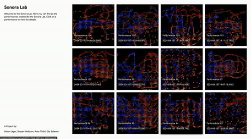

# Sonora Lab

Sonora Lab is a web application built for an installation, where you can draw and create music with your bodily movements. 

# Installation in Zürich
#### Toni Areal (Zurich University of the Arts)

# Gallery 
#### Visuals and Audio created by all the installation visitors, which was displayed next to the installation

Credits:
Stepan Vedunov
Elia Salerno
